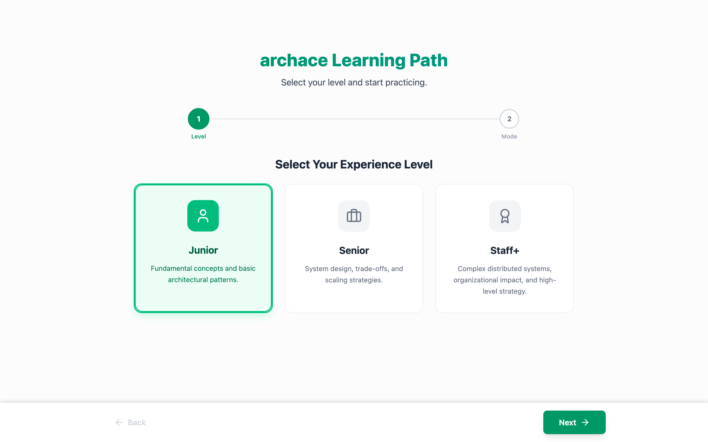
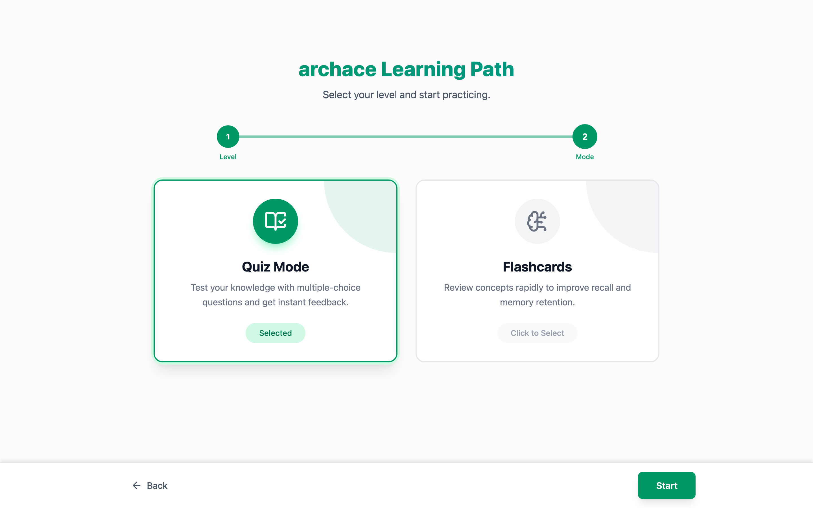
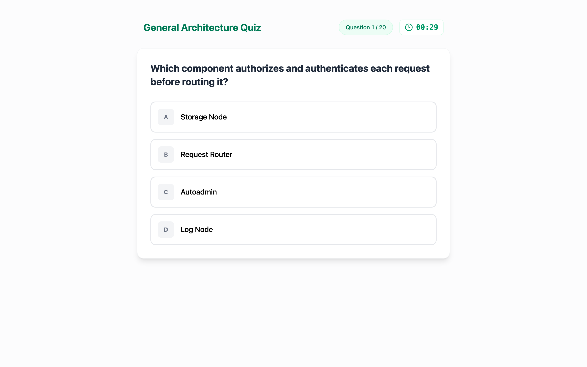
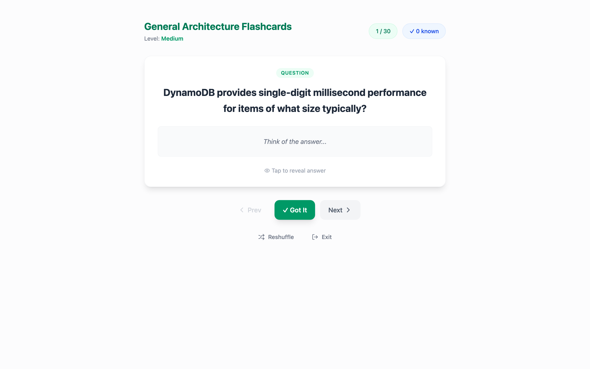

# [ArchAce](https://akgarhwal.github.io/archace/)

Practice software architecture the way interviews and real systems actually work: trade-offs, failure modes, and *why* a design holds up — not trivia.

Pick a level, pick quiz or flashcards, and go. Each session pulls about **30 random questions** from that path. The next time you load, missed items and unseen items come first. Answers you got right are remembered for **7 days** in a tiny local store, then forgotten so anything can appear again.

**Live app:** [https://akgarhwal.github.io/archace/](https://akgarhwal.github.io/archace/)

---

## What you do in the app

**1. Choose a level**

| Level | What it trains |
| --- | --- |
| **Junior** | Fundamentals and *why* the basic patterns exist |
| **Senior** | Scaling, isolation, and production trade-offs |
| **Staff+** | Deep internals, multi-system judgment, what you would actually choose |



**2. Choose how you want to practice**

- **Quiz** — timed multiple choice, instant feedback
- **Flashcards** — think first, flip for the answer, mark *Got it* when it sticks



**3. Work a session**





---

## How a session is built

1. Load the Google Sheet for **that level + mode** (the lecture path).
2. Shuffle and take about **30** questions (or the whole sheet if it is smaller).
3. Prefer questions you **got wrong** recently, then **new** ones.
4. Only if the bank is too small do recently-correct items come back.

Correct answers are stored as short hashes plus a day stamp in `localStorage` — not the question text. After 7 days those entries expire.

| Mode | Session size | Timer |
| --- | --- | --- |
| Quiz · Junior | ~30 | 30s / question |
| Quiz · Senior | ~30 | 45s / question |
| Quiz · Staff+ | ~30 | 60s / question |
| Flashcards | ~30 | none — flip at your pace |

---

## What the questions are (and are not)

Good questions ask how a system scales, where it breaks, and what you give up by choosing it.

> DynamoDB: why a hot partition key hurts you, and how you would model around it.

Not useful:

> In what year was DynamoDB released?

The replacement question bank in `content/` covers widely used tools only:

PostgreSQL · MySQL · B-tree & LSM · Cassandra · DynamoDB · Redis · AWS & S3 · Kubernetes · Java · Spring Boot · Python · C++ · Data Structures & Algorithms · Gen AI · AI Agents

---

## Question bank (CSV)

New questions live in the repo so you can review them and paste them into the existing Google Sheets. This bank is **803 quiz items** and **470 flashcards** (thinking questions, not trivia). Rebuild with `python3 scripts/merge_questions.py`.

| File | What it is |
| --- | --- |
| [`content/questions-quiz.csv`](content/questions-quiz.csv) | All quiz items (`Section`, `Level`, question, A–D, correct letter) |
| [`content/questions-flashcards.csv`](content/questions-flashcards.csv) | All flashcards (`Section`, `Level`, question, answer) |
| [`content/sheets/`](content/sheets/) | Same data split per level, ready to import into a sheet tab |

| Level | Quiz | Flashcards |
| --- | ---: | ---: |
| Junior | 215 | 122 |
| Senior | 379 | 226 |
| Staff | 209 | 122 |

Sheet tabs the app already reads:

| Level | Quiz GID | Flashcard GID |
| --- | --- | --- |
| Junior | `886577120` | `1099335189` |
| Senior | `1620893919` | `1910075225` |
| Staff | `1857699421` | `1484665705` |

Configured in `src/data/sheetConfig.ts`.

**Quiz columns:** `Question`, `Option A`, `Option B`, `Option C`, `Option D`, `Correct Answer` (`A`/`B`/`C`/`D`)

**Flashcard columns:** `Question`, `Correct Answer`

---

## Run locally

```bash
npm install
npm run dev
```

Then open [http://localhost:5173/archace/](http://localhost:5173/archace/).

```bash
npm run build     # production bundle
npm run preview   # preview that bundle
```

Pushes to `main` deploy to GitHub Pages via `.github/workflows/deploy.yml`.
